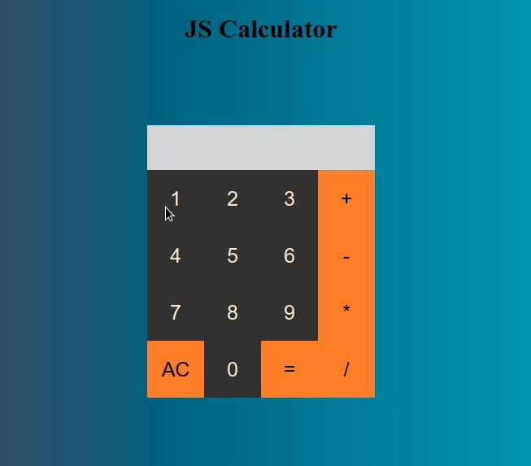

# Calculadora
Calculadora feita em javacript para operações simples como adicão, subtração, multiplicação e divisão. Aceita uma expressão do tamanho desejado e calcula de acordo com a importância das operações.

  

## Pré-requisitos
Ter um browser

## Como executar

Vá até a paste do projeto e clique no arquivo HTML, irá abrir direto no seu browser principal.
para executar o projeto.

## Estudado
* Javascript
